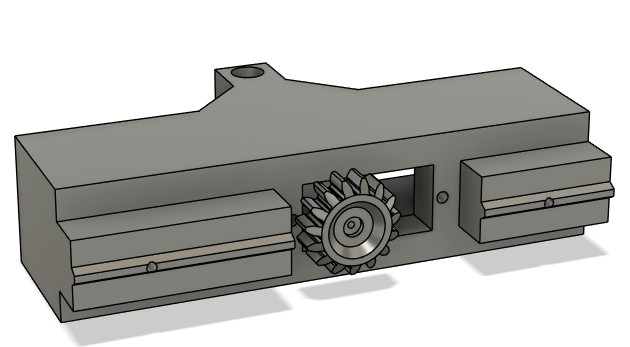

This document provides a detailed assembly guide for the plate handler (also known as the claw).

This assembly guide assumes all required components have been acquired, the front plastic cover has been removed and all 3D-printed parts from the 'CAD' folder are complete.

<ins>**3D assembly**</ins>

* *Top body (Verical movement)* 
  
1) The support brackets were slid into place on the front main body
   
   

2) The support bracket braces were then placed overthem prefitted with M3 square nuts push fitted in
   
   

2A) Then one M3 x 8 mm hex socket button screw was inserted through the front of each of the holes of the front main body and tightened up (Becareful not to overtighten else the screw extends further than the bracket and you risk scratching the OT-2 gantry!)

  

3) The servo motor is then attached to the lowering arm gear and subsequently screwed into postions

   

4) Then one M3 x 6 mm hex socket button screw was inserted from the back of each of the holes in the support bracket and a M3 square nut was loosely fit. This was then slid up the OT-2's gantry via the rails (Note remove the small screw if situated by the red arrow as this will prevent the fitting)

    

4A) The top body was then slid up the gantry until it was approximately 5 cm from the base of the gantry. The screws were then tightened up.

  

This is the completion of the top body.

* *Bottom body (Horizontal movement)* 
   

5) The servo motor was screw into position with the rotating axis aligned with the centre of the slider main body.

  

6) The slider main body gear was screwed into the servo

  

7) The back slider was then attached using the self-tapping screws (2.9 mm x 13mm)

   

8) The front slider was then attached using the seld-tapping screws (2.9 mm x 9.5 mm)

   

9) The sliding fork reinforce's were then added by sliding them into place <ins>AT THE SAME TIME</ins>.

    

10) The stopper was then push fitted into position

    

This is the completion of the bottom body.

<ins> Combining top with bottom </ins>

11) The lowering are was attached to the lower body and with the servo wire fed through the hole down the centre of the shaft after carefully removing the plastic casing. This was then reattached once the wire had been fed through.

    

11A) <ins>BE EXTRA CAREFUL HERE!</ins> The M3 x 20 slotted pan head screw was then screw into place with the M3 hex nut. Attaching the loweing arm to the lower body. Make to keep the servo wire away from the screw else you risk cutting the wire!

12) The gantry was then pulled all the way to the front of the device with the bottom body with rail being gently pushed through the rail cutout on the top body (the groves must be facing away from you).

    

Important: If you encounter excessive force or limited movement in any of the mechanical components, it's likely due to friction. To resolve this, carefully smooth any rough edges with a steel file and apply a small amount of mineral oil or another suitable lubricant.

<ins>Electronic assembly</ins>

13) Two sets of servo wires (horizontal and vertical servo motors) were fed from the top of the gantry following the ribbon cable pathway to ensure smooth operation, exiting the device via the back panel of the OT-2

    
    
    
    

14) The servo wires were then plugged into the raspberry pi zero wh at there connect location. In this case vertical motor control is #15 and horizontal motor control is #0 (Make sure the yellow pin is connected to the brown servo wire else the servo will no move and make a high pitch noise upon connection)

    

14A) The UART cable was then plugged into the raspberry pi zero wh:
  - Red (5V) - pin 2
  - Black (GND) - pin 6
  - Green (TXD) - pin 8
  - White (RXD) - pin 10

    

The USB end was then plugged into USB-1 of the OT-2

   

