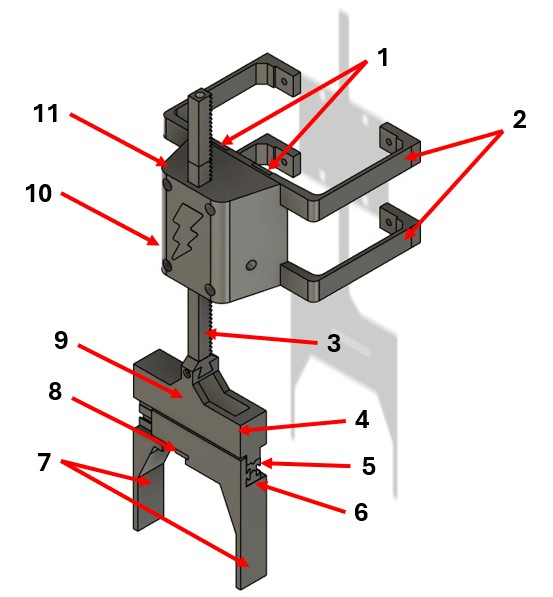

This folder contains all the files to 3d print the claw

1) Support bracket - 5.90 m
2) Support bracket brace - 1.17 m
3) Lowering arm - 2.37 m
4) Slider main body - 7.18 m
5) Back slider - 0.86 m
6) Front slider - 1.02 m
7) Sliding fork reinforce - 6.73 m
8) Stopper - 0.07 m
9) Slider main body gear - 0.16 m 
10) Lowering arm gear - 0.22 m 
11) Front main body - 12.84 m

Total PLA filament = 38.52 m 
