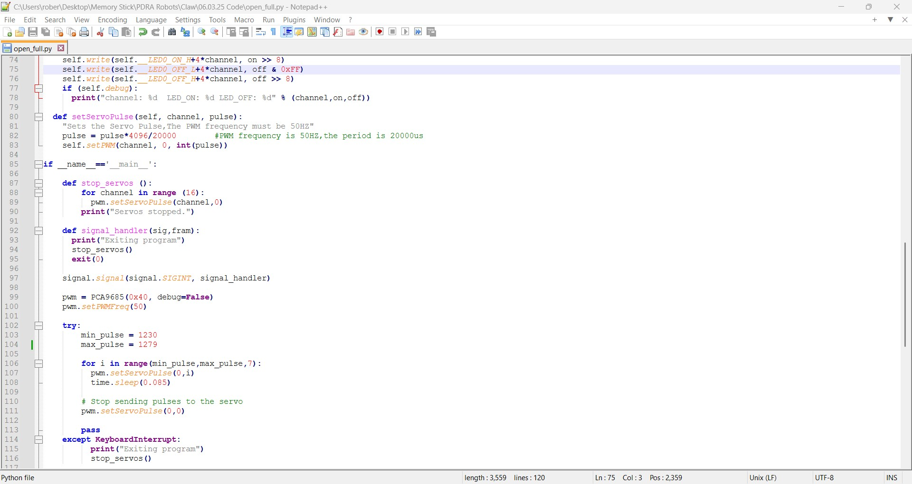

To ensure accurate and consistent labware handling, the following calibration procedure is required for the claw:

1. Coordinate Calibration

- Labware Dimensions: The maximum labware dimensions compatible with the deck are 127.76 mm in length and 85.57 mm in width. Therefore, the labware's geometric center is located at 63.88 mm (x-axis) and 42.79 mm (y-axis). The claw's vertical axis must align with this center.

- Coordinate Offsets:
X = 20.5 mm: This offset compensates for the P300 8-channel pipette's position in the right pipette slot, ensuring the claw is centered over the labware's x-axis.
Y = 86.0 mm: This offset accounts for the pipette mount's extension, preventing collisions between the labware and pipettes during retrieval along the y-axis.
Z = 174.0 mm: This vertical coordinate positions the claw sufficiently high to avoid interference during labware movement.

Resulting Position: The final retrieval position is defined by the following Python command:
```
position = plate["A6"].top().move(Point(x=20.5, y=86.0, z=174.0))
```


  2) The Claw calibration

The servo motor's operational range is defined by pulse width values in lines 103 and 104, spanning from 1230 to 1279. With a step increment of 7 (specified in line 106), this translates to a total pulse width variation of 49, resulting in 7 discrete movement steps. The pulse width is progressively increased, driving the gripping claw to its fully open position, which is then mechanically limited by a stopper.

   

A consistent calibration methodology is applied across all claw control scripts. These scripts are categorized as follows:

1. Closing Actions:

 - close: Standard closing action.
 - close_full: Full closure action.
 - close_small: Partial closure action.
 - close_small_hold: Partial closure with sustained pulse-width modulation (PWM) to maintain grip on heavier labware. The servo motor remains powered until an open_small script is executed.

2. Opening Actions:

  - open_small: Partial opening action.
  - open_full: Full opening action.

3. Downward Movement Actions:

  - down: Standard downward movement without labware.
  - down_full: Full downward movement with labware.
  The PWM values for these scripts are adjusted to the minimum limit of downward travel.

4. Upward Movement Actions:

  - up: Standard upward movement.
  - up_1: Alternative upward movement.
  - up_2: Upward movement with sustained PWM to maintain position when handling heavier labware. The servo motor remains powered until a down script is executed.

The PWM values for the scripts above are adjusted to the maximum upward travel limit, determined by the claw's structural design.
    
  - up_small: Upward movement with a specific PWM adjustment to accommodate labware with larger lips.
