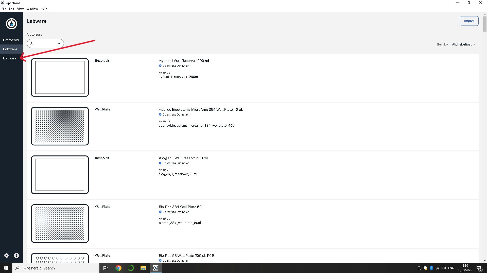
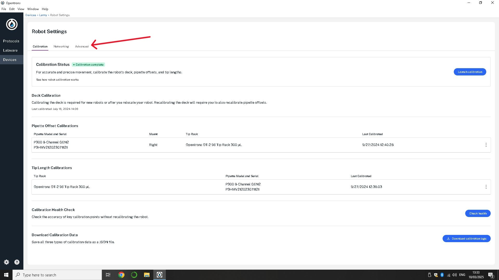

The following setup was applied to the raspberry pi zero wh:

- Preinstalled with Raspbian OS (32-bit)
- The following was performed in command terminal of the pi zero wh
  - sudo apt-get update
  - sudo apt-get upgrade -y
  - sudo apt-get install python3 python3-pip -y
  - sudo apt-get install python3-smbus -y
  - sudo raspi-config
    - I2C enabled
    - Serial enabled
  - sudo reboot
  - sudo pip install RPi.GPIO
  - sudo apt-get install p7zip-full
  - wget https://www.waveshare.com/w/upload/6/6c/Servo_Driver_HAT.7z
  - 7zr x Servo_Driver_HAT.7z -r -o./Servo_Driver_HAT
  - sudo chmod 777 -R Servo_Driver_HAT
  - cd Servo_Driver_HAT/Raspberry\ Pi/
  - cd python3/
  - sudo python3 PCA9685.py

The following files were loaded onto the pi zero wh:
1) uart_listner.py
2) up.py
3) up_1.py
4) up_2.py
5) down.py
6) down_full.py
7) open_small.py
8) open_full.py
9) close_small.py
10) close_small_hold.py
11) close_full.py

uart_listner.py starts on boot up

The following was perfomed after the installation of the 3D printed hardware
- The UART cable was plugged into USB-1 port
- The OT-2 was powered on and a minute was allowed for the raspberry pi wh to fully boot
- On the opentrons app go to devices
  
  - three dots in top right corner - robot settings
    
  - advanced settings
    
  - juypter notebook
    
  - open terminal command
- To confirm the device is connected run the following command:
  - ls /dev/
  - Look for ttyUSB0 (or subsequent number)
- If it is there run the following code to disable XON/XOFF flow control for input and output and to increase the baud rate to match the pi zero wh (this resets every time you unplug the usb or turn the OT-2 on)
  - stty -F /dev/ttyUSB0 -ixon -ixoff
  - stty -F /dev/ttyUSB0 speed 115200
- The device is now ready to run scripts
